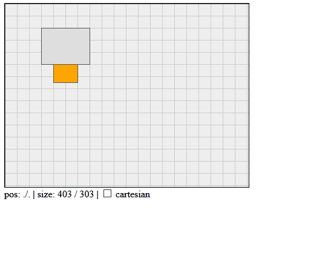

# canvas-area

## What is it ... ?

`canvas-area` is a lightweight custom html element as a controller parent for one or more canvas elements.
It allows *zoom*, *pan* and *resize* interactions.

## Show me ...



## Where is the markup code ...

```html
<canvas-area id="ca" width="401" height="301" resizable="both">
    <canvas id="c"></canvas>
</canvas-area>
```

### Attributes

* `width`: width of element in `px`.
* `height`: height of element in `px`.
* `resizable`: one of [`'none'`, `'horizontal'`, `'vertical'`, `'both'`].
* `cartesian`: `true` or `false`


## Example please ...

[try it out ...](https://goessner.github.io/canvas-area/canvas-area)

## Show me the scripting API ...

`canvas-area` behaves as a standard html container element with known inherited DOM properties and methods. Additionally it offers properties ...

| Property | Type | Value | Default |
|:---|:---:|:---|:---:|
|`width`|Number| width of element in `px`| `300 px` |
|`height`|Number| height of element in `px`| `150 px` |
|`resizable`|String| one of [`'none'`, `'horizontal'`, `'vertical'`, `'both'`]| `'none'`|
|`cursor`|String| simple interface to CSS cursor attribute. | `'auto'` |
|`view`|`{x,y,scl}`| origin location `x,y` in `px` and scaling factor `scl` | `{0,0,1}` |
|`cartesian`|Boolean| `true`: `y`-axis pointing up, <br>`false`: `y`-axis pointing down  | `false` |

... methods ...

| Method | Arguments | Returns |Comment |
|:---|:---|:---:|:---|
|`pan({dx,dy})`|`dx`: delta x<br>`dy`: delta y | `undefined`| origin displacement. Modifies `view` property |
|`zoom({x,y,scl})`|`x`: x-center<br>`y`: y-center<br>`scl`: factor | `undefined`| zoom about point `{x,y}` by factor `scl`. Modifies  `view` property  |
|`pntToUsr({x,y})`| point | point | transform argument point (device coordinates) to result point (user coordinates) with respect to `view` property  |
|`notify(key,value)`|`key`:&nbsp;event&nbsp;type<br>`value`:&nbsp;event&nbsp;data |`undefined`| notify observers of event type `key` about event `value`|
|`on(key,handler)`|`key`:&nbsp;event&nbsp;type<br>`handler`:&nbsp;event&nbsp;handler|`this`| register `handler` with event type `key`. |

... and events, which can be observed via `observe` method.


| Type | Object | Value |
|:---|:---:|:---|
|`'pointer'`|`{x,y,...}`<sup>*</sup>| User has moved the pointer. |
|`'drag'`|`{x,y,...}`<sup>*</sup>| User has moved the pointer with left button down. |
|`'resize'`|`{width,height}`| User did resize `canvas-area` element |
|`'view'`|`{x,y,scl}`| User modified the `view` property via *pan*, *zoom*, ... |
|`'buttondown'`|`{x,y,...}`<sup>*</sup>| User has pressed the pointer device's button down. |
|`'buttonup'`|`{x,y,...}`<sup>*</sup>| User has released the pointer device's button. |
|`'pointerenter'`|`{x,y,...}`<sup>*</sup>| pointer has entered the `canvas-area`. |
|`'pointerleave'`|`{x,y,...}`<sup>*</sup>| pointer has left the `canvas-area`. |

`{x,y,...}`<sup>*</sup> custom event data object: 


| Property | Description |
|:---|:---|
|`x,y`| Pointer location in device coordinates. |
|`dx,dy`| Pointer displacement in device coordinates since last pointer event. |
|`buttons`| Device buttons pressed (`1`:left, `2`: right, `4`: middle button). |
|`delta`| Mouse wheel delta units. |

## CDN

Use following link for `canvas-area.js`.
* `https://gitcdn.xyz/cdn/goessner/canvas-area/master/canvas-area.js`


## FAQ
* __Can we use multiple *canvases* with `canvas-area` ?__
  * `canvas-area` is a container element for potentially multiple `canvas` elements.
  * Multiple *canvases* are mostly used as layers stacked on top of each others in practice. Please note here:
    * for every `canvas` element except the first one use `position:absolute;` style.
    * stacking level can be made explicite using `z-index: 5;`  style.
    * `canvas` elements are transparent by default. So avoid giving them individual background colors.
    * `canvas-area` is managing the *resize*  of its `canvas` children, but not their - then necessary - `redraw`.
    * `canvas-area` is managing the *view* parameters for *pan* and *zoom*, but does not apply those values to the `canvas` contexes. Do that by yourself while redrawing or by using the `on('view',...)` handler.

* __Does not work properly with Mobile Device X and Touch Screen Y ?__
  * Desktop browsers only are addressed primarily at current.
  * Implementation of touch events is experimental (*pan* works with touch and *resize* also using a *pen* now).
  * Issues with Microsoft Edge.

* __Can you implement feature X and possibly feature Y ?__
  * `canvas-area` serves my personal needs very well as it is.
  * So ... no, I won't.
  * Please go ahead and implement it by yourself.
  * If you think, your enhancement is of common interest, you are very welcome, to send me a pull request.

## Changelog

###  [0.4.5] on January 19, 2018
* chainable method `on(key,handler)` added.
* method `observe(key,handler)` marked as deprecated. Use `on(key,handler)` instead.
* renamed event property `buttons` to `btn` in [`drag`,`pointer`,`buttondown`,`buttonup`,`pointerenter`,`pointerleave`] event.
* necessary styles `display: block; overflow: hidden;` automatically added as inline style while constructing.
* touch events experimentally implemented.

###  [0.4.0] on January 06, 2018
* Initial release.

## License

`canvas-area` is licensed under the [MIT License](http://opensource.org/licenses/MIT)

 © [Stefan Gössner](https://github.com/goessner)
